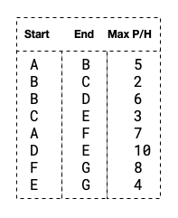
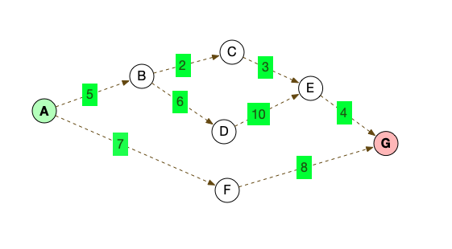
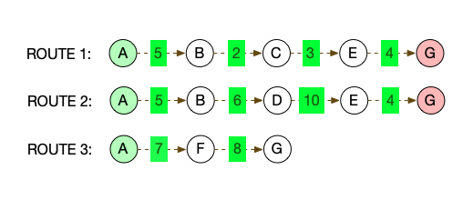
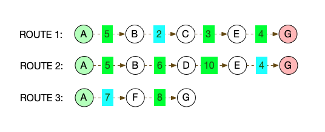

# #1 Engineering Problem Solving

## Solution Approach

The given system of tunnels _(A -> B, MaxCarsPerHour)_ can be converted to a directed graph. We can then use depth first search to find the individual tunnel routes, and determine the critical path with the highest throughput. Throughput for any subnetwork is limited by the smallest capacity along that route.

For example if we were to receive this example input:

We can use the data to construct a directed graph, which would look like this:

Each location _(start or end)_ becomes a vertex, and the numbers inbetween the vertexes are the max capacities as known and given by the input.

The head vertex would be the vertex with no parents, and the tail vertex would be the one with no children.

Using depth first seach we can find all the individual routes from head to tail, such as these:

Once we have all the routes, we look at each one and determine it's maximum capacity.
This would be the minimum throughput of any segment, as the minimum capacity of any route would create a bottle neck and rate limit the overall troughput of the subnetwork.

The maximum output of the network from the head to tail would be the route with the highest maximum output, in this case ROUTE 3 (AFG) `7`.

## Improvements

This model does not account for overflow, where other routes capcitites are added to the primary route. A potential solution would be to calculate the maximum capacity of other sub-networks, detect saturation and add that to the total capacity.

## Code Example

Here's an [example](question1-example.ts "TypeScript Example") written in TypeScript. You could clone and run it using a protoyping tool like [Quokka](https://quokkajs.com/ "Quokka") in Visual Studio IDE.
